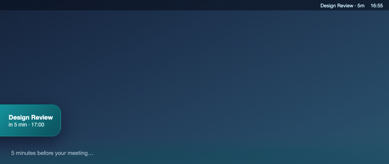
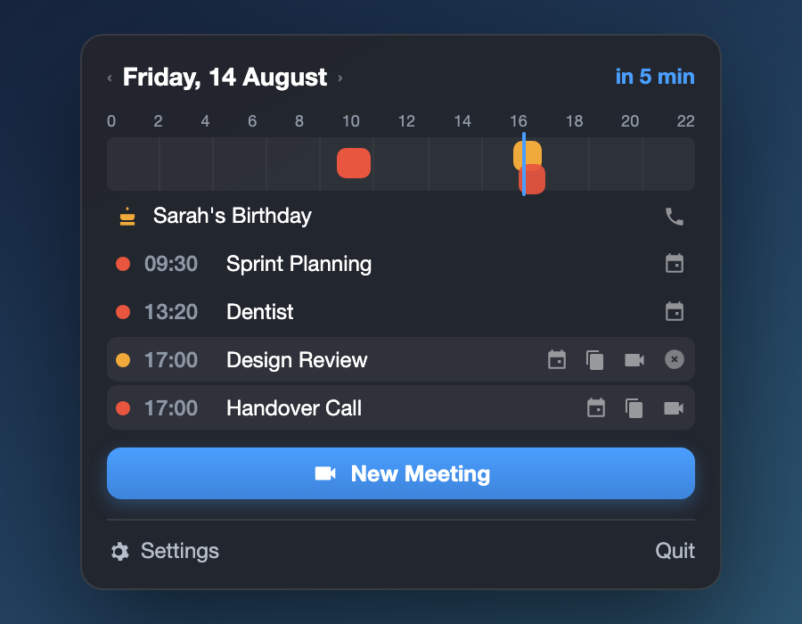
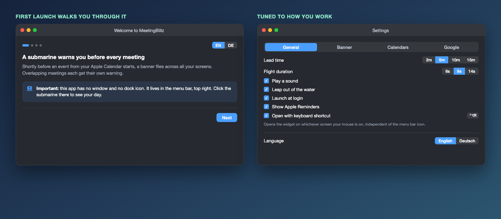
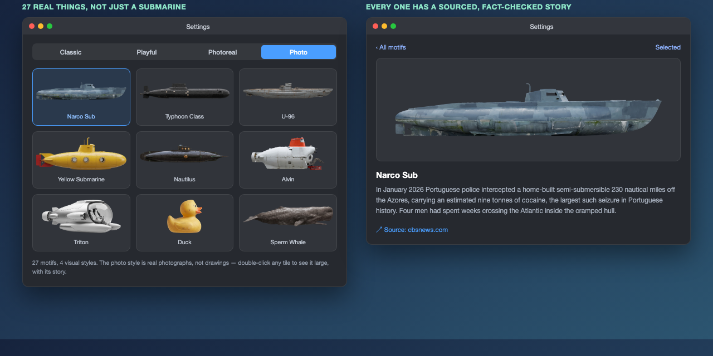

# MeetingBlitz

**Eine macOS-Menüleisten-App, die dich vor jedem Termin warnt.** Kurz bevor
etwas aus deinem Apple Kalender beginnt, fliegt ein U-Boot über deine
Bildschirme.

### ⬇ [MeetingBlitz 1.4 laden](https://github.com/Felixosk/meetingblitz-mac/releases/latest/download/MeetingBlitz.zip)

Fertige App · 2,8 MB · macOS 14+ · Apple Silicon **und** Intel ·
[ein Befehl beim ersten Start](#möglichkeit-a-fertige-app-laden) ·
oder [selbst bauen](#möglichkeit-b-selbst-bauen) in zwei Minuten

[English version](README.md)





*Ein Klick aufs U-Boot in der Menüleiste zeigt deinen Tag: Zeitachse,
Geburtstage mit Anruf-Knopf, und pro Termin Link kopieren, beitreten,
.ics exportieren oder ausblenden.*

## Warum es sie gibt

Zwei Gründe, und die sind der ganze Zweck der App.

**1. Jeder überschneidende Termin bekommt seine eigene Warnung.** Die meisten
Tools zeigen *den* nächsten Termin: eine Zeile, eine Mitteilung, ein Zeitfenster.
Ein Call, der in einem Fokusblock steckt, oder zwei übereinander gebuchte
Termine fallen damit still zu einer einzigen Erinnerung zusammen, und den
anderen verpasst man. Hier bekommt jeder Termin sein eigenes Banner, und
überschneidende stapeln sich in eigenen Bahnen, statt sich zu ersetzen. Bei
MeetingBar ist genau dieser Wunsch
[seit Mai 2021 offen](https://github.com/leits/MeetingBar/issues/271).

**2. Eine sichtbare Warnung statt einer Mitteilung.** Mitteilungen sind darauf
gebaut, ignorierbar zu sein: Sie schieben sich an den Rand, warten ein paar
Sekunden und legen sich in eine Liste, die man später anschaut. Für eine
Paketankündigung ist das richtig, für etwas, das in fünf Minuten anfängt,
nutzlos. An einem U-Boot, das über alle Monitore fliegt, scrollt man nicht
vorbei. Und weil die App es selbst zeichnet, landet es nie in „Nicht stören",
steht nie hinter den Mitteilungen anderer Apps an und erscheint auf allen
Bildschirmen gleichzeitig.

---

## Im Vergleich

Es gibt schon gute Kalender-Apps für die Menüleiste. Hier steht, wo jede sitzt
und wo diese sich wirklich unterscheidet.

| | MeetingBlitz | [MeetingBar](https://github.com/leits/MeetingBar) | [Itsycal](https://github.com/sfsam/Itsycal) | [Calendr](https://github.com/pakerwreah/Calendr) |
|---|---|---|---|---|
| Überschneidende Termine warnen **einzeln** | **ja** | nein ([offen seit 2021](https://github.com/leits/MeetingBar/issues/271)) | entfällt | entfällt |
| Art der Warnung | Banner fliegt über **alle** Bildschirme | Menüleistentext, Mitteilung, optional Vollbild | keine | keine |
| **Warnung vor Überschneidung beim Anlegen** | **ja** | nein | nein | nein |
| Erkannte Meeting-Links | 53 Dienste | 50+ Dienste | keine | einfach |
| Termin als Fließtext eintippen | ja (`fr 16 uhr bis 17 uhr call mit chris`) | nein | nein | ja |
| Wochen-/Monatswahl im Widget | ja, ein Klick schaltet durch | nein | ja | ja |
| Zweite Zeitzone | ja | nein | nein | ja |
| Auswertung (Woche/Monat/Jahr) | ja | nein | nein | nein |
| URL-Schema für Automation | `meetingblitz://` | Kurzbefehle + AppleScript | nein | `calendr://` |
| Apple Erinnerungen in derselben Liste | ja | nein | ja | ja |
| Kalenderquellen | Apple Kalender (damit iCloud, Google, Exchange über macOS) | Apple Kalender + Google direkt | Apple Kalender | Apple Kalender |
| Reife | Hobbyprojekt | 5300 Sterne, jahrelang poliert | 4000 Sterne | 2300 Sterne |

Diese drei sind das Feld: Unterhalb von Calendr findet eine Suche nach
Menüleisten-Kalendern für macOS nichts mehr über einer Handvoll Sterne. Die
anderen bekannten Vertreter sind kommerziell und nicht quelloffen — **Dato** und
**Fantastical** — deshalb stehen sie hier nur als Namen und nicht mit Häkchen in
einer Tabelle: Ihr Funktionsumfang lässt sich von außen nicht belegen.

### Das andere Feld: Apps, die dich unterbrechen

Die Tabelle oben vergleicht Kalender. MeetingBlitz will aber gar kein Kalender
sein, sondern dich *unterbrechen* — und dieses Feld ist deutlich kleiner. Alles,
was es darin gibt, Stand August 2026:

| | Sterne | Sprache | Wie unterbrochen wird | Kann außerdem |
|---|---|---|---|---|
| **MeetingBlitz** | dieses Repo | Swift | Banner pro Termin, auf allen Bildschirmen, überschneidende stapeln sich | beitreten, anlegen, Freitext, Kollisionswarnung, Auswertung, Erinnerungen |
| [QuakPit](https://github.com/Ooble-Studio/QuakPit) | 110 | TypeScript | eine Gummiente fliegt über den Bildschirm | sonst nichts; letzter Push Mai 2026 |
| [meeting-reminder](https://github.com/nilBora/meeting-reminder) | 7 | Swift | Vollbild-Overlay, das alles blockiert | Beitreten mit einem Klick |
| [alwayshaveaplan](https://github.com/ChrisZou/alwayshaveaplan) | 18 | Swift | zeigt den Tagesplan beim Entsperren | — |
| [cyclop](https://github.com/akalikbergenov/cyclop) | 225 | Swift | Notch-Panel, Kalender ist einer von vielen Tabs | Zwischenablage, Snippets, Dateiablage, Übersetzung |

QuakPit zeigt, dass die Idee zieht: 110 Sterne für eine Ente, die nichts weiter
tut als fliegen. Was überall fehlt, ist das *pro Termin* — und alles, was man
nach der Erinnerung eigentlich tun will.

**Ganz ehrlich:** Wer die reifste, bestgepflegte Lösung mit der breitesten
Dienstabdeckung will, installiert MeetingBar. Die App ist hervorragend, und
dieses Projekt hat als ihr Fan angefangen.

Im Wortlaut des offenen Wunsches dort: „Wenn zwei Termine zur selben Zeit
liegen, sehe ich in der Leiste nur, dass einer aktiv ist." Dazu ein verwandter
Fehler, bei dem die Vollbild-Mitteilung für den ersten von zwei knapp
aufeinanderfolgenden Terminen
[gar nicht erst kommt](https://github.com/leits/MeetingBar/issues/769).



## Was sie kann

- **Banner vor jedem Termin**, gleichzeitig auf allen Monitoren, Vorlaufzeit einstellbar
- **27 Skins in 4 Stilen** für dieses Banner — statt des U-Boots auch ein Wal, ein Jet, ein UFO oder 24 andere; der Foto-Stil zeigt das echte Vorbild, ein Doppelklick zeigt die belegte Geschichte dahinter
- **Tagesübersicht** in der Menüleiste, mit Zeitachse, Wochen-/Monatswahl und jedem Tag einen Klick entfernt
- **Beitreten mit einem Klick** für 53 Dienste: Meet, Zoom, Teams, Webex, Whereby, Jitsi, Discord, Slack-Huddles, GoTo, Tencent und mehr
- **Termin in einer Zeile tippen**: `fr 16 uhr bis 17 uhr call mit chris`, mit Vorschau bevor etwas entsteht
- **Warnung vor Überschneidungen** beim Anlegen, *bevor* doppelt gebucht wird
- **Sofort-Meeting**: ein Klick erzeugt den Meet-Raum, legt den Termin an und öffnet den Call
- **Auswertung** für Woche, Monat und Jahr als Balkengrafik
- **Termin als .ics exportieren**, landet direkt als Datei in der Zwischenablage
- **Apple Erinnerungen**, die heute fällig sind, stehen mit in der Übersicht
- **Pro Kalender einstellbar**, was angezeigt wird, was ein Banner auslöst und ob Geburtstage mitkommen
- **Abgesagte Termine warnen nie** — sie bleiben durchgestrichen sichtbar
- **Ruhe-Modus**, befristet (1h / 5h / 1 Tag / 1 Woche) und automatisch bei Bildschirmfreigabe, mit stillem Hinweis statt gar nichts
- **Zwei globale Tastenkürzel**, beide umbelegbar: Widget öffnen, laufendem oder nächstem Call beitreten
- **Automation** über `meetingblitz://show`, `join-next`, `instant`, `create?text=…`
- **Zweite Zeitzone** im Widget, versteckt sich bei gleicher Zeit
- Komplett auf **Deutsch oder Englisch**, live umschaltbar

Optional, nur mit eigener Google-Cloud-Konfiguration: Termine mit fertigem
Google-Meet-Link direkt aus der App anlegen. Ohne diese Konfiguration ist die
Funktion einfach ausgeblendet, alles andere funktioniert normal.
[Anleitung dazu weiter unten.](#optional-termine-mit-google-meet-link-anlegen)

## Nicht nur ein U-Boot

Unter **Einstellungen → Banner & Erinnern** lässt sich das Flugobjekt aus 27
Motiven wählen, in vier Stilen von der schlichten Silhouette bis zum echten
Foto. Jedes Motiv im Foto-Stil bildet etwas Reales nach, ein U-Boot aus dem
Kalten Krieg, einen Wal, der ein Walfangschiff versenkt hat, eine Badeente,
die fünfzehn Jahre durch den Pazifik trieb, und ein Doppelklick auf eine
Kachel zeigt die tatsächliche Geschichte dahinter samt Quelle, geprüft gegen
echte Belege statt aus dem Gedächtnis geschrieben.



## Voraussetzungen

- **macOS 14 (Sonoma) oder neuer**
- Apple Silicon oder Intel, die App wird als Universal Binary gebaut
- **Xcode Command Line Tools** zum Bauen (einmalig, siehe unten)

## Installation

### Möglichkeit A: fertige App laden

`MeetingBlitz.zip` aus dem [neuesten Release](https://github.com/Felixosk/meetingblitz-mac/releases/latest)
laden, entpacken und **MeetingBlitz.app** nach **Programme** ziehen.

Die App ist mit einem selbstgebauten Zertifikat signiert, nicht mit einem
bezahlten Apple-Entwicklerkonto. macOS stellt sie deshalb beim Download unter
Quarantäne. Ein Befehl hebt das auf:

```bash
xattr -dr com.apple.quarantine /Applications/MeetingBlitz.app
```

Danach startet sie normal. **Was der Befehl tut, sollte klar sein:** Du sagst
macOS damit, dass du selbst für diese App bürgst, und überspringst die
Gatekeeper-Prüfung. Führe ihn nur bei Software aus, der du wirklich traust —
hier kannst du vorher jede Zeile Quelltext lesen, oder gleich Möglichkeit B
nehmen.

Ohne den Befehl geht es auch umständlich: doppelklicken, im Hinweis auf
**Fertig**, dann **Systemeinstellungen → Datenschutz & Sicherheit → Trotzdem
öffnen**, und noch einmal bestätigen.

### Möglichkeit B: selbst bauen

Zwei Minuten, und gar kein Gatekeeper-Tanz: selbst kompilierte Software wird
nicht unter Quarantäne gestellt.

```bash
git clone https://github.com/Felixosk/meetingblitz-mac.git
cd meetingblitz-mac
```

Falls die Command Line Tools fehlen, installiert dieser Befehl sie (ein paar
hundert MB, einmalig):

```bash
xcode-select --install
```

Dann bauen und starten:

```bash
./build.sh && open dist/MeetingBlitz.app
```

Beim ersten Start führt dich ein kurzer Einstieg durch Kalenderfreigabe,
Kalenderauswahl und Autostart. Du kannst ihn jederzeit über
**Einstellungen → Allgemein → Einführung → Nochmal zeigen** wiederholen.

### Falls du eine fertig gebaute App bekommen hast

Dann greift Gatekeeper, weil die App nicht von einem bezahlten
Apple-Entwicklerkonto signiert ist. Der Weg auf aktuellen macOS-Versionen:

1. App nach **Programme** ziehen, und zwar **vor** dem ersten Start. Sonst läuft
   sie aus einem temporären Nur-Lese-Ordner und "Beim Login starten" funktioniert
   nicht zuverlässig.
2. Doppelklick. Im Dialog "Apple konnte nicht überprüfen…" auf **Fertig** klicken.
   Niemals "In den Papierkorb legen".
3.  → **Systemeinstellungen** → **Datenschutz & Sicherheit**, dort ganz nach
   unten zum Abschnitt **Sicherheit**. Da steht jetzt "MeetingBlitz wurde
   blockiert" mit dem Knopf **Trotzdem öffnen**.
4. Nochmal doppelklicken und im letzten Dialog **Öffnen** bestätigen.

**Schritt 3 muss zeitnah nach Schritt 2 passieren**, sonst verschwindet der Knopf
und du fängst bei Schritt 2 an. Danach ist die App dauerhaft freigeschaltet.

Der früher übliche Rechtsklick → Öffnen funktioniert seit macOS 15 **nicht mehr**
und führt in denselben Blockier-Dialog.

Nur falls tatsächlich "beschädigt und kann nicht geöffnet werden" erscheint:

```bash
xattr -cr "/Applications/MeetingBlitz.app"
```

### Wichtig zu wissen

**Diese App hat kein Fenster und kein Dock-Symbol.** Sie lebt oben rechts in der
Menüleiste. Wenn nach dem Start scheinbar nichts passiert, ist das kein Fehler:
Such das U-Boot in der Menüleiste und klick es an.

## Optional: Termine mit Google-Meet-Link anlegen

Alles oben funktioniert ohne das hier. Nur diese eine Funktion — der Knopf
**Sofort-Meeting** und der Meet-Link an selbst angelegten Terminen — spricht in
deinem Namen mit Google und braucht deshalb Zugangsdaten, die *dir* gehören. Es
gibt keinen gemeinsamen App-Schlüssel, und im Repository liegt keiner.

Einmalig, etwa zehn Minuten:

1. In der [Google Cloud Console](https://console.cloud.google.com/) ein Projekt
   anlegen (Name egal).
2. **APIs und Dienste → Bibliothek**: die **Google Calendar API** aktivieren.
3. **APIs und Dienste → OAuth-Zustimmungsbildschirm**: **Extern** wählen, App-Name
   und eigene Mailadresse eintragen. Unter **Zielgruppe** die eigene
   Google-Adresse als Testnutzer hinzufügen. *(Mit einem Workspace-Konto
   stattdessen Intern wählen — dann laufen die Tokens nicht alle 7 Tage ab.)*
4. **APIs und Dienste → Anmeldedaten → Anmeldedaten erstellen → OAuth-Client-ID**,
   Anwendungstyp **Desktop-App**. Die JSON-Datei herunterladen.
5. Diese Datei hierhin legen, den Ordner notfalls anlegen:

```bash
mkdir -p ~/Library/Application\ Support/MeetingBlitz
cp ~/Downloads/client_secret_*.json ~/Library/Application\ Support/MeetingBlitz/google-oauth.json
```

6. MeetingBlitz neu starten. Unter **Einstellungen → Meetings erstellen** gibt es
   jetzt **Mit Google verbinden**. Einmal anmelden; der Refresh-Token landet im
   Schlüsselbund von macOS, nie in einer Datei.

Ohne diese JSON-Datei bleibt der ganze Bereich ausgeblendet und es läuft kein
Google-Code.

**Zur 7-Tage-Falle:** Solange der OAuth-Client im Modus *Testing* steht, verwirft
Google die Refresh-Tokens nach einer Woche und man muss sich neu verbinden. Der
Knopf **Veröffentlichen** im Zustimmungsbildschirm (oder eine interne
Workspace-Zielgruppe) beendet das dauerhaft.

## Berechtigungen und Datenschutz

Die App fragt beim ersten Start nach **Kalenderzugriff**, optional nach
**Erinnerungen**. Beides bleibt lokal auf deinem Mac. Es gibt keinen Server,
keine Telemetrie und keinen Account. Der Quellcode liegt hier vollständig offen.

Der Google-Teil ist optional und kommt nur zum Zug, wenn du selbst eine
OAuth-Konfiguration hinterlegst. Im Repository sind keine Zugangsdaten enthalten.

## Wenn etwas klemmt

**Das Menüleisten-Icon ist nicht da.** Der häufigste Grund ist banal und kostet
sonst Stunden: In der Menüleiste rechts vom Notch ist der Platz begrenzt (auf
einem MacBook rund 790 Punkte für alle Apps zusammen). Ist er voll, wirft macOS
Icons **kommentarlos** raus, ohne Fehlermeldung. Abhilfe: andere Menüleisten-Apps
beenden, oder das Fenster einfach per **⌃⌥M** öffnen.

**Die App sieht keine Termine.** Systemeinstellungen → Datenschutz & Sicherheit →
Kalender → MeetingBlitz einschalten. Achtung, macOS kennt dort auch die Stufe
"nur hinzufügen": Damit darf die App zwar schreiben, sieht aber nichts. Es muss
der volle Zugriff sein.

**Statusbericht erzeugen.** Rechtsklick auf das Menüleisten-Icon →
"Diagnose speichern". Der Bericht landet in `~/Downloads` und nennt Version,
Berechtigungen, Bildschirme und Fensterpositionen im Klartext. Er enthält deine
Kalendernamen, schau also kurz drüber, bevor du ihn weitergibst.

## Mit Claude Code

Wenn du Claude Code nutzt: Im Repository liegt eine `CLAUDE.md` mit Architektur,
Bau-Anleitung und den Stolperfallen, in die man bei dieser App reinläuft. Öffne
Claude Code einfach in diesem Ordner und sag, was klemmt.

## Lizenz

MIT, siehe [LICENSE](LICENSE).
